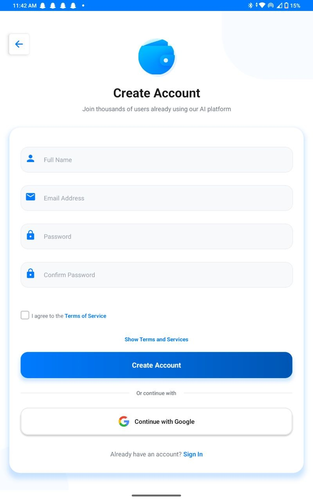
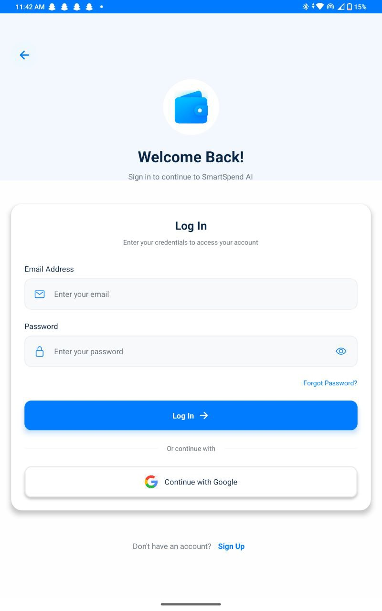
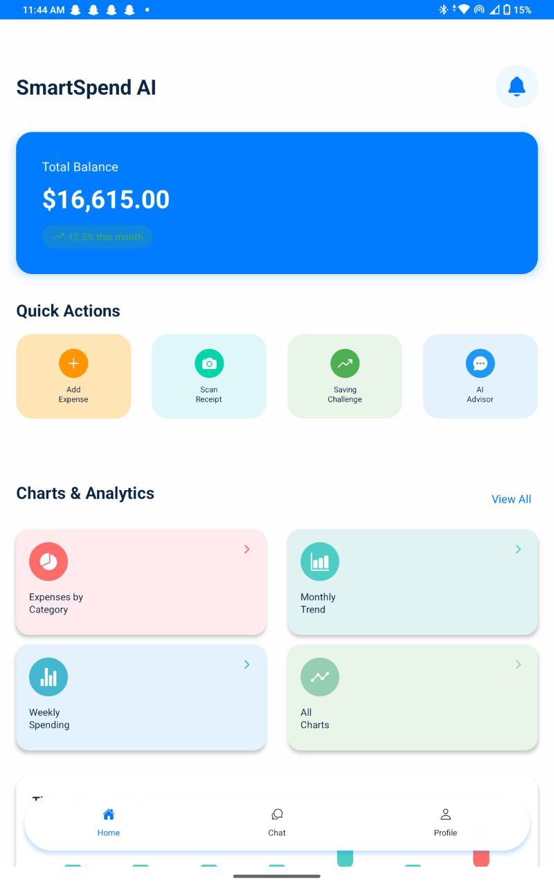
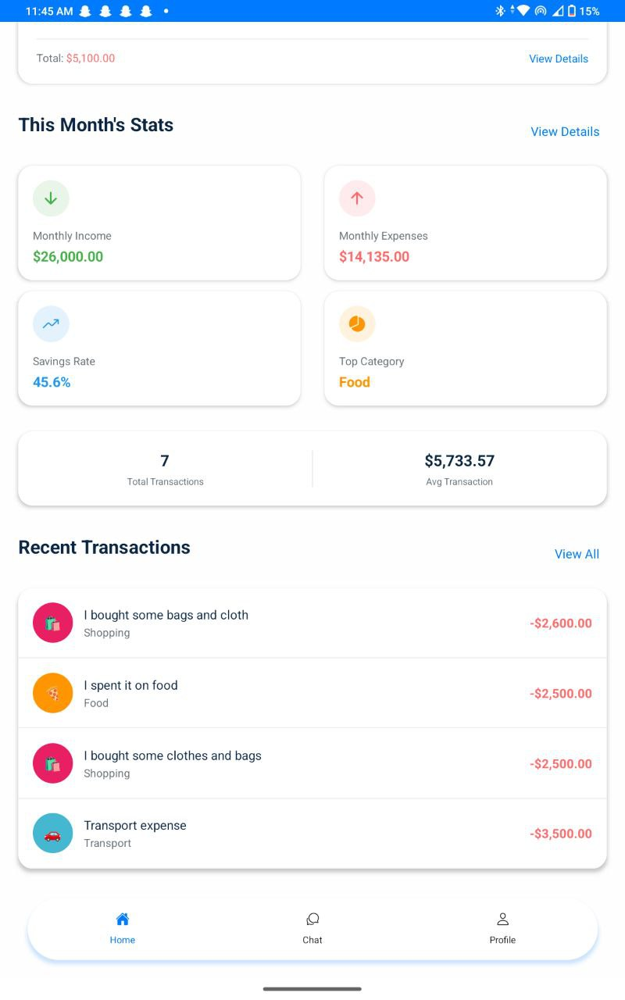
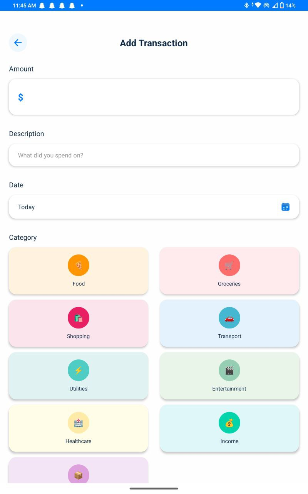
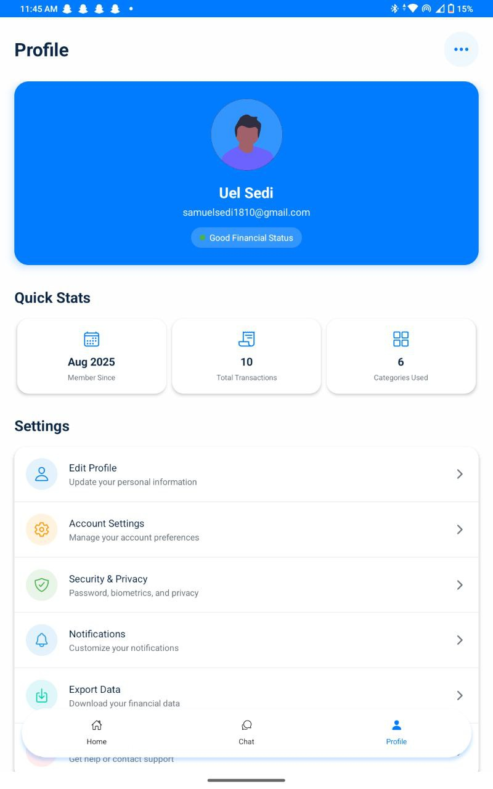
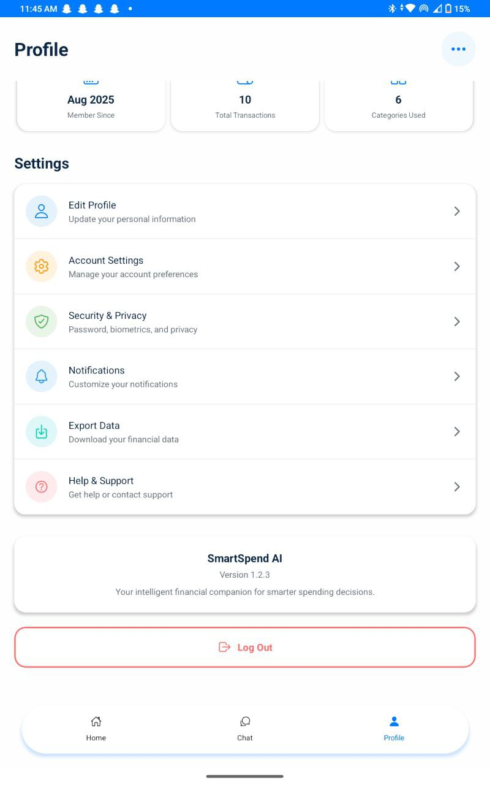

# SmartSpend AI 💰

**Track Smarter. Spend Better.**

SmartSpend AI is a comprehensive mobile finance application designed to help users take control of their financial health. With an intuitive UI and intelligent insights, users can easily track expenses, monitor income, and visualize their spending habits.

## 📱 Screenshots

<div align="center">
  <table>
    <tr>
      <td align="center">
        
        <br /><b>Splash Screen</b>
      </td>
      <td align="center">
        
        <br /><b>Create Account</b>
      </td>
      <td align="center">
        
        <br /><b>Login</b>
      </td>
      <td align="center">
        
        <br /><b>Dashboard</b>
      </td>
    </tr>
    <tr>
      <td align="center">
        
        <br /><b>Analytics & Stats</b>
      </td>
      <td align="center">
        
        <br /><b>Add Transaction</b>
      </td>
      <td align="center">
        
        <br /><b>User Profile</b>
      </td>
      <td align="center">
        
        <br /><b>Settings</b>
      </td>
    </tr>
  </table>
</div>
## ✨ Key Features

* **Secure Authentication:** Seamless Sign Up and Login with Email or Google integration.
* **Smart Dashboard:** View total balance, quick actions, and financial summaries at a glance.
* **Expense Tracking:** Easily log daily transactions with specific categories (Food, Transport, Shopping, etc.).
* **Visual Analytics:** Interactive charts showing income vs. expenses, savings rates, and top spending categories.
* **AI Advisor:** Intelligent financial advice based on your spending habits.
* **Receipt Scanning:** Scan receipts to automatically log expenses.
* **Profile Management:** Manage account settings, security, and data export.

## 🛠 Tech Stack

* **Frontend:** React Native / Expo
* **Language:** JavaScript / TypeScript
* **Navigation:** React Navigation
* **Styling:** StyleSheet / NativeWind
* **Backend:** (Add your backend here, e.g., Firebase, Node.js, Spring Boot)

## 🚀 Getting Started

1.  **Clone the repository**
    ```bash
    git clone [https://github.com/yourusername/smartspend-ai.git](https://github.com/yourusername/smartspend-ai.git)
    ```

2.  **Install dependencies**
    ```bash
    npm install
    # or
    yarn install
    ```

3.  **Run the application**
    ```bash
    npx expo start
    ```

## 🤝 Contributing

Contributions are welcome! Please feel free to submit a Pull Request.

## 📄 License

This project is licensed under the MIT License.
